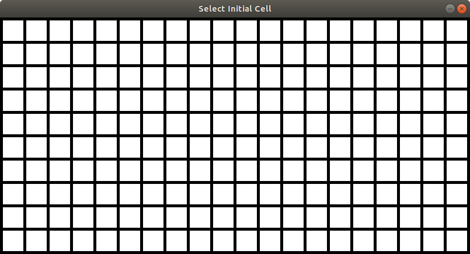

# Probabilistic Goal Recognition - Grid World

User controls an actor moving in a grid world, heading it toward one of the goal cells present in the grid. While moving, system estimates where actor is headed computing and updating a probability distribution over the set of goal cells.
## Dependencies 
- All code is written in Python 3.
- Third-party library **pygame** is used to construct the grid world.
- Third-party library **matplotlib**  is used to plot probabilities.
- Automated planner **Fast Downward** is used to compute probabilities.

It is assumed to use a Linux machine. 
### Installing Fast Downward
Install all Fast Downward's dependencies with
```bash
sudo apt-get install cmake g++ g++-multilib mercurial make python
```
Then download Fast Downward in *this* directory
```bash
hg clone http://hg.fast-downward.org downward
```

and build it 
```bash 
cd downward
 ./build.py
```
## Running the code 
Running the application with
```bash
python gridworld.py
```
you will see a 11x11 grid world appear and prompt you for specifying initial, goal and obstacle cells.
For convenience reasons, it is also possible to specify world dimensions. For example, 
```bash
python gridworld.py 10 20
```
will create a grid world with 10 rows and 20 columns. Only dimensions in range 5÷25 are accepted. If, for any reason, wrong command line arguments are passed, application handles it in a proper way.

## Costructing grid world
Running the application the following window will open. Select the initial cell clicking on it with the mouse



The selected cell will become green. After that application will prompt for a certain number of goal cells. When selected the number of cells desired press *enter* to continue (Note that in the previous step was not required to press *enter* being the start cell unique).


Select the obstacles cells in an analogous manner.
Actor can be moved around with the numeric keypad.


At this point grid world is constructed and actor will appear in the start position.


Actor can be moved around with the numeric keypad.


## Controls
Agent can move orizontally, vertically and diagonally. Use of numerical keypad is straightforward.

- 1: moves down and left.
- 2: moves down.
- 3: moves down and right. 
- 4: moves left.
- 6: moves right.
- 7: moves up and left.
- 8: moves up.
- 9: moves up and right.

If an action is not legal, it will be simply ignored.

## Probabilities 
Probabilities are printed in terminal while moving, as shown in the following screenshoot. Goals are ordered from bottom-up and (if in the same row) from left to right. 


Each list, i.e., each probability distribution is also represented as bar graph and saved in *plots* folder. Folder is cleaned up at each run.


